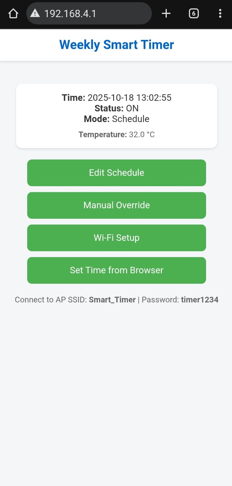
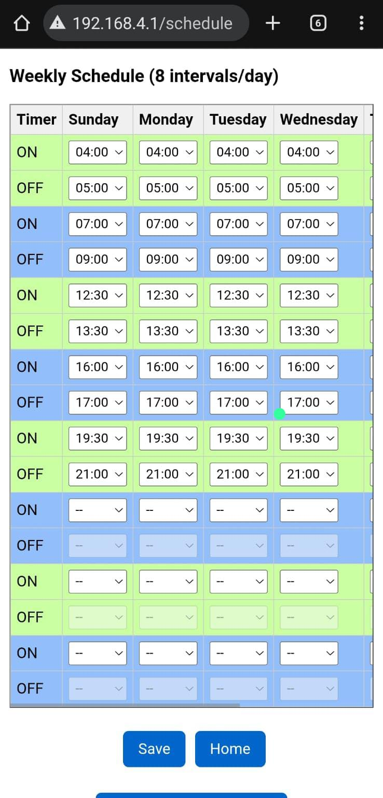
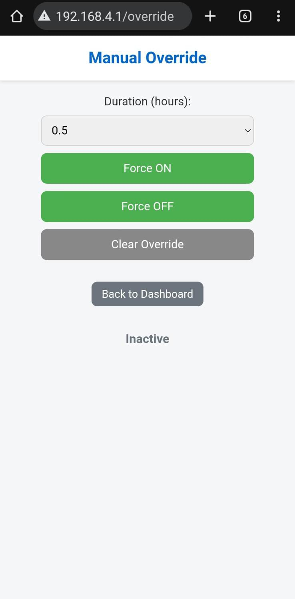
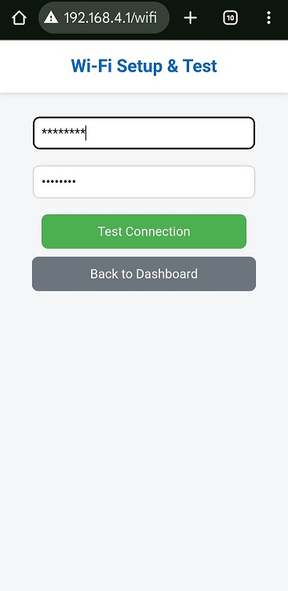
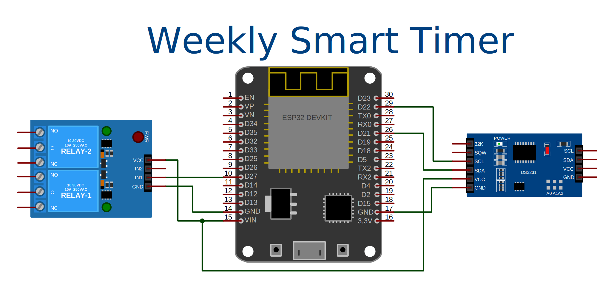

# Weekly Smart Timer (ESP32 + DS3231)

A robust **Weekly Smart Timer** built on **ESP32 WROOM + DS3231 RTC**, supporting **8 programmable daily intervals**, with **NTP fallback**, persistent configuration via **LittleFS**, and a clean mobile-friendly **Web UI** for management.
---
## Expected Audience

This project is designed for home automation tasks requiring accurate (as much permitted by internal or external RTC) and repeatable scheduling, even without internet connectivity.  
It was developed and tested in Pakistan (UTC+5). Instructions for customizing the timezone are provided in the header section of the main `.ino` file.

---

## ✨ Features

- **ESP32 WROOM** for WiFi + high reliability
- **DS3231 RTC** for high-accuracy timekeeping
- **Automatic NTP time sync** when WiFi is available  
  (used if RTC has failed or is invalid)
- **8 programmable daily intervals**
- **Web-based configuration panel**  
  - Edit schedule  
  - Manual override  
  - WiFi setup  
  - Set time from browser  
  - Shows current mode, relay state, temperature
- **Persistent storage using LittleFS**
- **Hotspot/AP mode** if WiFi not configured
- **Fail-safe time handling** (RTC watchdog → NTP sync)
- **Relay control with selectable active-low logic**

## 📸 Web UI Screenshots

<table>
  <tr>
    <td align="center"> Dashboard</td>
    <td align="center"> Schedule Editor</td>
    <td align="center"> Override Setup</td>
    <td align="center"> WiFi Setup</td>
  </tr>
</table>

---

## 🧰 Hardware Requirements

| Component        | Description                         | Notes                                |
|------------------|-------------------------------------|---------------------------------------|
| ESP32 WROOM      | Main microcontroller                | GPIO27 = Relay, GPIO2 = Status LED    |
| DS3231 RTC       | Real-time clock (I²C)               | Address `0x68`                        |
| Relay Module     | 5V/3.3V relay driver                | Active-LOW supported                  |
| Power Supply     | Stable 5V for ESP32 + peripherals   |                                       |

---

## 🔌 Wiring Diagram
Full schematic (SVG):

---

## 🔧 Installation

### **1. Install ESP32 Board Support**
Arduino IDE →  
**File → Preferences → Additional Boards Manager URLs**
https://dl.espressif.com/dl/package_esp32_index.json

Then open:  
**Tools → Board Manager → ESP32 → Install**

---

### **2. Required Libraries**
Install via Arduino Library Manager:

- `RTClib` (Adafruit)
- `ArduinoJson`
- `LittleFS_esp32`
- `WebServer` (built in ESP32 core)
- `time.h` (built-in)

---

### **3. Upload Firmware**
1. Board: **ESP32 Dev Module**  
2. Partition Scheme: **Default 4MB with spiffs (1.2MB APP/1.5MB SPIFFS)**  
3. Upload `.ino` file  
4. (Optional) Upload LittleFS data using the plugin

---

## 🌐 Web Interface

### Modes
- **STA Mode** (WiFi configured)
- **AP Mode** (fallback)  
  - SSID: `your_AP_SSID`  
  - Password: `your_AP_PASS`  
  - IP: `192.168.4.1`

### UI Sections
- Dashboard (time, relay status, RTC state)
- Schedule Editor (8 intervals × 7 days)
- Manual Override
- WiFi Setup
- Set Time (browser → RTC)

---

## 🕒 Timekeeping Logic

1. **Primary:** DS3231 RTC  
2. **If RTC invalid:**  
   → Enable STA Mode → Sync with NTP  
3. **On success:**  
   → Write correct time back to RTC  
4. **Schedules operate in local time (PKT / UTC+5)**  
5. Internal system time uses UTC via `settimeofday()`

This ensures accurate operation even after:
- Power failures  
- Internet outages  
- RTC battery depletion  

---

## 🧪 Verified Configuration

- ESP32 WROOM Dev Module  
- DS3231 RTC with CR2032  
- LittleFS filesystem  
- Works fully offline

## ⚠️ Disclaimer

This project is provided **for educational, experimental, and hobby use only**.  
By using this software, wiring diagram, or any related material, **you agree that you are solely responsible for your own build, safety, wiring, and results**.

The author provides **no guarantees** regarding:

- Proper operation or accuracy  
- Fitness for any particular purpose  
- Electrical safety  
- Reliability of timing, relay switching, or RTC accuracy  
- Freedom from defects, bugs, or unexpected behavior  
- Suitability for commercial or industrial applications  

Using this project with **relays, mains voltage, heaters, motors, pumps, or any externally connected equipment** is entirely **at your own risk**.

The author is **not responsible** for:

- Damage to property  
- Loss of equipment  
- Fire, electrical failure, or hazards  
- Financial loss or business interruption  
- Data loss or corruption  
- Missing, delayed, or incorrect timer actions  
- Any emotional or psychological distress  
- Any result of modifying, adapting, or reusing this code  

---

## 🛡️ Legal Notice (MIT License)

This project is distributed under the **MIT License**.

Under the MIT License:

> **“THE SOFTWARE IS PROVIDED ‘AS IS’, WITHOUT WARRANTY OF ANY KIND…  
> IN NO EVENT SHALL THE AUTHORS OR COPYRIGHT HOLDERS BE LIABLE FOR ANY CLAIM, DAMAGES OR OTHER LIABILITY…”**

This means:

- You **cannot hold the author liable** for anything that happens due to use or misuse  
- You **cannot claim damages** of any kind  
- All responsibility remains with **you, the user**  
- Using or modifying this project indicates **full acceptance of the MIT License terms**  

For full details, please refer to the LICENSE file included in this repository.

